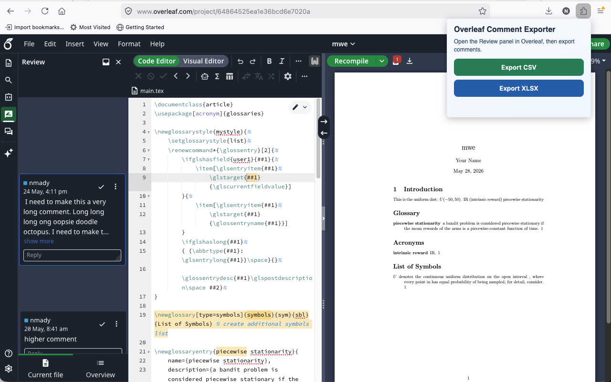

# Overleaf Comment Extractor

A Firefox add-on designed to streamline collaborative academic writing by easily extracting and organizing comments from Overleaf projects. 

Managing feedback across multi-author manuscripts can be a high-friction process. Developed within the **[Autotelic Interaction Research Group](https://www.aalto.fi/en/department-of-computer-science/autotelic-interaction-research)** at **Aalto University**, this tool emerged from the practical need to simplify complex writing workflows in our own research on self-directed behavior. By reducing the administrative overhead of addressing co-author feedback, this extension allows researchers to focus more on their core science and less on software logistics. 

## How to Use


## What’s Here

- `extension/`: the Firefox-compatible browser extension.
- `samples/`: sample Overleaf exports and reference CSVs for comparison.

## Build

```bash
cd extension
npm install
npm run build
```

## Package For addons.mozilla.org (AMO)

```bash
cd extension
npm install
npm run package
```

The packaged artifact is written to `extension/web-ext-artifacts/`.

Optional pre-submit checks:

```bash
cd extension
npm run validate:release
```

AMO submission checklist: `AMO_RELEASE_CHECKLIST.md`.

## Load The Extension

1. Open Firefox and go to `about:debugging`.
2. Choose This Firefox and click Load Temporary Add-on.
3. Select `extension/manifest.json`.
4. Reload Overleaf after the extension is loaded.

## Export Flow

1. Open an Overleaf project with review comments.
2. Use the extension popup to start an export.
3. Download the generated CSV and compare it with the reference files in `samples/` when needed.

## Notes

- Build artifacts in `extension/dist/` are generated and should not be edited by hand.
- Generated CSV outputs are intentionally kept out of version control.
- Privacy policy for AMO submission: `PRIVACY.md`.

## Acknowledgments & Funding
This software is maintained by the [Autotelic Interaction Research Group](https://www.aalto.fi/en/department-of-computer-science/autotelic-interaction-research) and its development is generously supported by the **Helsinki Institute for Information Technology (HIIT)**.

## Citation
If you use this tool to assist in your academic writing or research workflow, please consider citing it:

> Ady, Nadia M. (2026). *Overleaf Comment Extractor* (Version 0.1.0) [Browser Extension]. Aalto University / Helsinki Institute for Information Technology. 

## License 
This project is licensed under the MIT License - see the LICENSE file for details.